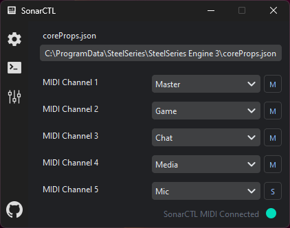
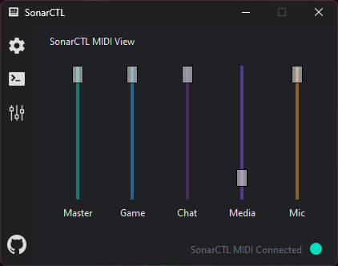

# SonarCTL Software

This software allows you to control your SteelSeries Sonar slider with a custom MIDI controller.

## How to Use

1. **Ensure you have a SonarCTL MIDI controller**:
    - If you don't have one, you can build one by following the instructions in the [SonarCTL Firmware repository](https://github.com/CyR1en/SonarCTL-Firmware).

2. **Connect your SonarCTL MIDI controller to your computer**.

3. **Install Python**:
    - Ensure you have Python version between 3.6 and 3.12 installed on your computer.

4. **Clone this repository**:
    ```shell
    git clone https://github.com/CyR1en/SonarCTL.git
    cd SonarCTL
    ```

5. **Initialize the virtual environment**:
    ```shell
    python -m venv venv
    ```

6. **Activate the virtual environment**:
    - **Windows**:
        ```shell
        .\venv\Scripts\Activate
        ```
    - **Linux**:
        ```shell
        source venv/bin/activate
        ```

7. **Install the dependencies**:
    ```shell
    pip install -r requirements.txt
    ```

8. **Run the app**:
    ```shell
    pythonw -m src.SonarCTL
    ```

## Screenshots

### Configuration Screen


### Console Screen


### Slider Screen


## Attribution

This software uses [Mark788k's steelseries-sonar-py](https://github.com/Mark7888/steelseries-sonar-py) library to communicate with the SteelSeries Sonar.
This software allows you to control your SteelSeries Sonar slider with a custom MIDI controller.